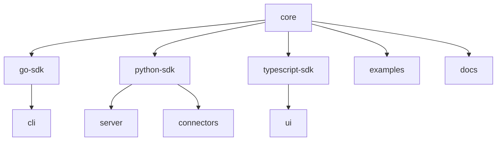

# FedMCP GitHub Repository Structure Plan

> **Created**: January 17, 2025  
> **Purpose**: Define the GitHub organization structure for FedMCP open source release  
> **Decision**: Multi-repository approach with clean component naming  

## 📋 Repository Structure

The FedMCP project will be organized under the `github.com/fedmcp` organization with the following repositories:

```
github.com/fedmcp/
├── core                 # Core protocol definitions & specifications
├── server               # Reference FastAPI server implementation
├── cli                  # Go command-line tool
├── ui                   # Next.js web interface
├── go-sdk               # Go SDK
├── python-sdk           # Python SDK
├── typescript-sdk       # TypeScript SDK
├── connectors           # Connector framework & examples
├── docs                 # Documentation website
└── examples             # Quickstart & integration examples
```

## 🎯 Rationale

### Why Multi-Repository?

1. **Industry Standard**: Following patterns from Kubernetes, Docker, HashiCorp
2. **Clean Naming**: Avoids redundant `fedmcp/fedmcp` that appears amateurish
3. **Independent Versioning**: Critical for multi-language SDK support
4. **Clear Ownership**: Each component has focused maintainers
5. **Contributor Friendly**: Lower barrier to entry for specific components

### Repository Responsibilities

#### `fedmcp/core`
- Protocol specification (JSON schemas)
- Artifact type definitions
- Security requirements
- Compliance documentation
- Reference test vectors

#### `fedmcp/server`
- FastAPI reference implementation
- Audit logging integration
- Storage backends (local, S3)
- Docker deployment configs
- Server-specific documentation

#### `fedmcp/cli`
- Go command-line tool
- Commands: create, sign, verify, push
- Configuration management
- Man pages and help docs

#### `fedmcp/ui`
- Next.js 15 web application
- Artifact browser & manager
- Audit trail viewer
- Signature verification UI
- Authentication integration

#### `fedmcp/{go,python,typescript}-sdk`
- Language-specific implementations
- Package managers (go.mod, pyproject.toml, package.json)
- Language-specific tests
- SDK documentation & examples
- Independent semantic versioning

#### `fedmcp/connectors`
- Connector framework (`fmcpx` CLI)
- Example connectors
- Connector development guide
- Templates and scaffolding

#### `fedmcp/docs`
- Documentation website source
- Getting started guides
- API reference
- Integration tutorials
- Architecture diagrams

#### `fedmcp/examples`
- Quickstart examples
- Docker Compose setups
- Integration patterns
- Healthcare use cases
- Cross-language examples

## 🚀 Migration Plan

### Phase 1: Repository Creation
1. Create GitHub organization `fedmcp`
2. Create all repositories with proper descriptions
3. Set up repository settings (branch protection, etc.)
4. Configure GitHub Actions secrets

### Phase 2: Code Migration
Split current monorepo into individual repositories:

```bash
# Example for Python SDK
git filter-repo --path core/python/ --path-rename core/python/:
git remote add origin https://github.com/fedmcp/python-sdk.git
git push -u origin main
```

### Phase 3: Documentation Updates
1. Update all import paths
2. Fix cross-repository links
3. Update CI/CD workflows
4. Create organization README

### Phase 4: Release Coordination
1. Tag initial versions (v0.1.0) in each repo
2. Publish packages to registries
3. Create release announcement
4. Update main website

## 📝 Repository Templates

### Common Files for All Repos
- `README.md` - Repository-specific documentation
- `LICENSE` - Apache 2.0
- `CONTRIBUTING.md` - Contribution guidelines
- `SECURITY.md` - Security policy
- `.github/workflows/` - CI/CD pipelines
- `.gitignore` - Language-specific ignores

### Repository Topics
All repositories should include these GitHub topics:
- `fedmcp`
- `fedramp`
- `compliance`
- `government`
- Language-specific tags (go, python, typescript)

### Branch Protection
- Main branch: `main`
- Require PR reviews
- Require status checks
- Dismiss stale reviews
- No force pushes

## 🔗 Inter-Repository Dependencies



## 📊 Success Metrics

- Clean URLs without redundancy
- Independent release cycles working smoothly
- Clear contribution patterns per repository
- Reduced onboarding time for new contributors
- Successful cross-repo integration examples

## 🚫 What We're Avoiding

- ❌ `github.com/fedmcp/fedmcp` - Redundant naming
- ❌ `github.com/fedmcp/fedmcp-core` - Unnecessary prefixes
- ❌ Single monorepo - Too complex for contributors
- ❌ Overly granular repos - Avoid 20+ tiny repositories

## 📅 Timeline

1. **Week 1**: Create organization and repositories
2. **Week 2**: Migrate code to individual repos
3. **Week 3**: Update documentation and CI/CD
4. **Week 4**: Initial releases and announcements

---

*This plan ensures FedMCP follows industry best practices while maintaining a professional, approachable structure for open source contributors.*